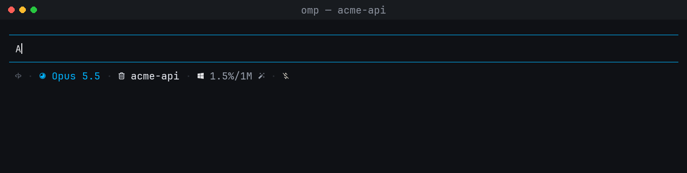

# omp-prompt-autocomplete

AI help for the oh-my-pi (`omp`) prompt box:

- **Ghost-text autocomplete.** Pause while typing and a short continuation appears in dim text. Accept all of it, or one word at a time.
- **One-key prompt refine.** Press **Alt+E**, pick an instruction ("Polish", "Make it concise", …) or type your own, and the draft is rewritten in place before you send it. Pressing **Enter** always sends the text exactly as it is in the editor.

Both features use small, fast models through omp's own providers and logins. The agent's model, roles and thinking level are never touched.



<sub>Recorded in a live omp 18.4.4 session. The badges show which key was pressed.</sub>

## Install

```sh
omp plugin install omp-prompt-autocomplete
```

From a local checkout:

```sh
cd omp-prompt-autocomplete
omp plugin link .
```

Restart omp afterwards. Requirements: omp 18.4 or newer, and a login for the model used (by default `google-antigravity/gemini-3.1-flash-lite`; see [Models](#models)).

## Autocomplete

| Key | Action |
| --- | --- |
| **Tab** | Accept the whole suggestion and add a trailing space (omp's native behaviour) |
| **→** | Accept the whole suggestion exactly |
| **Ctrl+→** | Accept the next word only. Also works with **Alt+→** and **Alt+F**, or whatever `tui.editor.cursorWordRight` is bound to |
| **Esc** | Dismiss the suggestion. Pressing Esc again keeps omp's normal behaviour |

Word-at-a-time acceptance uses Unicode word segmentation, so languages written without spaces between words (Thai, Japanese, Chinese) advance one dictionary word at a time. Punctuation stays attached to the word before it (`requests.`), and the rest of the suggestion stays on screen without a new request.

Suggestions appear only at the end of a line. Native menus, spelling, `/` commands, `!` shell lines, `@`/`^` mentions and path completion keep priority.

## Refine

1. Type a prompt.
2. Press **Alt+E**. A picker replaces the editor:
   - Press **Enter** to use the highlighted preset. It starts on the last one you used.
   - Type your own instruction, for example `fix grammar and keep it in Thai`, then press **Enter**.
   - **↑/↓** move between presets. **Tab** copies the highlighted preset into the text field so you can edit it. **Esc** cancels.
3. Your draft is rewritten in place. A line under the editor shows the current state:
   - `✎ Refining prompt · Polish · Esc cancel · Enter sends it unchanged`
   - `✓ Refined · Polish · Enter send · Esc restore original · Alt+E refine again`

| While… | Key | Effect |
| --- | --- | --- |
| refining | **Esc** | Cancel the rewrite. The draft is not changed |
| refining | **Enter** | Send the original draft. The rewrite is dropped |
| refining | typing | Cancel the rewrite and keep editing |
| refined | **Enter** | Send the rewritten prompt |
| refined | **Esc** | Restore the original draft. The next Esc behaves normally (for example, it interrupts the agent) |
| refined | **Alt+E** | Refine the rewritten prompt again with another instruction |

Once you edit the rewritten text, the refined state ends. From then on, Esc and undo work normally. While the rewritten text is unedited, no autocomplete suggestion is shown, so Esc always restores the original.

Omp's undo key (**Ctrl+-** by default) also restores the original in terminals that pass it through. Windows Terminal uses Ctrl+- to zoom out, so on Windows use Esc.

Presets:

| Preset | Instruction |
| --- | --- |
| Polish | Fix grammar, spelling and awkward wording; keep meaning, tone and length |
| Fix grammar only | Fix grammar, spelling and punctuation only |
| Make it concise | Remove filler and repetition; keep every requirement |
| Make it clear for the agent | Put the goal first, then context, constraints and what done looks like, without inventing requirements |
| Translate to English | Translate to natural English; leave code and paths unchanged |

Your last three custom instructions are listed above the presets as `recent` until omp restarts.

Attachments are protected. Placeholders such as `[Image #1, …]` and `[Paste #2, +30 lines]`, as well as skill and model chips, are passed to the model as text that must not change. If the rewrite drops or duplicates one of them, the rewrite is rejected and your draft stays unchanged.

Names and versions are protected too. Small models tend to "correct" names newer than their training data, for example rewriting `Claude Haiku 5.5` as `Claude Haiku 3.5`. The model is told to keep names and version numbers exactly as written, and the rewrite is checked afterwards. If it drops a number from your draft or adds a version that appears nowhere in the draft, the instruction or the session background, it is rejected and your draft stays unchanged. Plain counts the model adds (`two` → `2`, numbered list items) are allowed. If your own instruction mentions a number (`change 5.5 to 6`), that number may change.

To change the shortcut, set `OMP_PROMPT_REFINE_KEY` (for example `ctrl+shift+e`) in the environment before starting omp. Run `/hotkeys` to check for conflicts.

## Commands

```text
/autocomplete status                 Show both models, where each came from, context state, and the (unchanged) agent model
/autocomplete off | on               Turn ghost suggestions off or on for this session (refine keeps working)
/autocomplete context off | on       Stop or resume sending session background with requests (this session only)
/autocomplete model <spec>           Override the autocomplete model for this session: provider/id or @role, e.g. @tiny
/autocomplete refine-model <spec>    Override the refine model for this session
/autocomplete model default          Clear the override (same for refine-model)
```

## Models

Model order, from highest priority:

- **Autocomplete:** a session override, then `modelRoles.autocomplete`, then `google-antigravity/gemini-3.1-flash-lite`
- **Refine:** a session override, then `modelRoles.refine`, then `modelRoles.autocomplete`, then `google-antigravity/gemini-3.1-flash-lite`

Set a default model for each feature in `~/.omp/agent/config.yml`:

```yaml
modelRoles:
  autocomplete: cerebras/qwen-3.8-27b   # needs to be very fast; called on every pause
  refine: google-antigravity/gemini-3.1-flash-lite
```

Requests always use the model's lowest reasoning effort, so a `:level` suffix makes no difference. Models are looked up read-only with `ctx.models.resolve`. Requests go straight to `completeSimple` with omp's credential resolver. The plugin never calls `setModel` or `registerProvider`, and never changes roles or thinking levels.

If no model is available, for example because you are not logged in, autocomplete shows one warning and then stays quiet until you run `/autocomplete on` or change the model. Refine explains the problem when you press the shortcut.

## What is sent

**Autocomplete** makes one request after a 180 ms typing pause. Each request contains:

- a fixed system prompt;
- up to 2,048 characters before the cursor and 512 after it;
- background, unless `/autocomplete context off` is set:
  - the project folder and session name;
  - up to 10 file paths from the agent's recent `read`/`write`/`edit` calls (paths only, never file contents);
  - the last 4 conversation turns, about 1.5 KB in total.

Thinking blocks, tool output, images and `<system-reminder>` blocks are never sent. Requests use at most 96 output tokens, temperature 0 and a 4-second deadline. A reply that arrives after the text has changed is discarded.

**Refine** sends the whole draft once, up to 16,000 characters, together with your instruction, the list of protected placeholders and the same optional background. Refine has a 30-second deadline, and the output budget grows with the draft length up to 8,192 tokens. The reply must be wrapped in `<prompt>…</prompt>`. Terminal control characters are removed and nothing is executed.

Draft text never appears in notifications or error messages.

## Development

```sh
bun install
bun test          # unit tests plus editor tests on the real omp editor
bun run typecheck
```

The `@oh-my-pi/*` packages are optional peer dependencies. At runtime omp gives the plugin its own copies, and the dev dependencies exist only for tests and type checking. Keep the version in `devDependencies` the same as the omp release you are testing against.

Source layout:

| File | Role |
| --- | --- |
| `src/index.ts` | Extension entry: editor installation, model resolution, refine shortcut, `/autocomplete` command |
| `src/editor.ts` | `CustomEditor` subclass: ghost integration, word-at-a-time accept, refine state (cancel, apply, undo) |
| `src/controller.ts` | Debounced, cancellation-safe ghost suggestion state machine |
| `src/client.ts` | Autocomplete request building and reply normalisation |
| `src/refine.ts` | Refine presets, request building, placeholder protection, reply parsing |
| `src/picker.ts` | Refine instruction picker component |
| `src/next-word.ts` | Unicode word segmentation for Ctrl+→ |
| `src/context.ts` | Bounded session background collection |

## License

MIT
